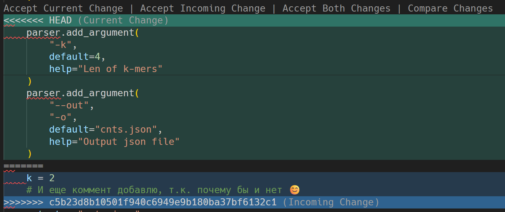
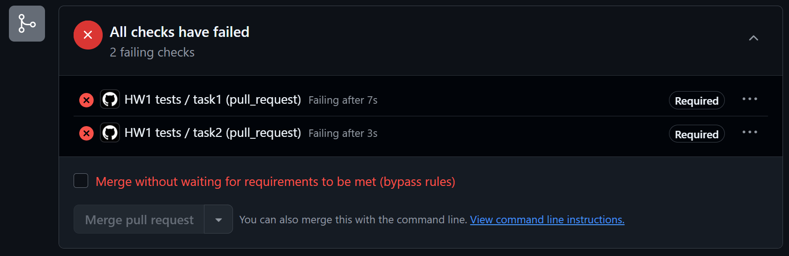
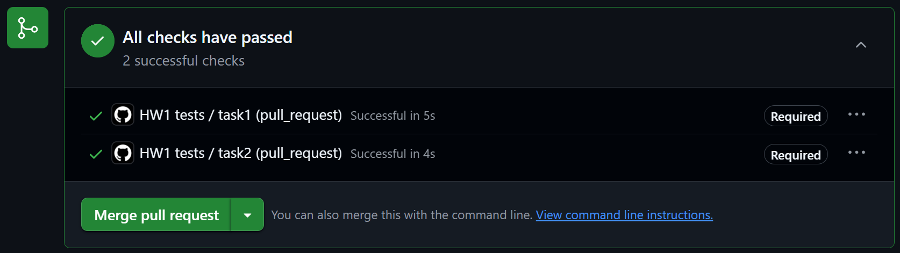

# ДЗ 1
Данная директория содержит выполненное ДЗ 1.

## Task 1
### Файлы:
[complement.py](complement.py) -- содержит код, написанный в рамках задания 2.2.

### Описание:
Репозиторий был успешно скопирован и заполнен необходимыми файлами. Код, печатающий reverse-complement последовательности и ее GC-состав, был помещен в файл [complement.py](complement.py) и проверен на работоспособность. Файл был сохранен, закоммичен и отправлен на github командой ```git add ./hw1/*; git commit -m "task1"; git push origin main``` . Тег был прикреплен к "голове" командой ```git tag task1``` .

## Task 2
### Файлы:
[count_kmers.py](count_kmers.py) -- содержит код, написанный в рамках задания 3.1.

[test.fna](test.fna) -- fasta файл для тестирования скрипта [count_kmers.py](count_kmers.py).

[cnts.json](cnts.json) -- результат работы скрипта [count_kmers.py](count_kmers.py) на [test.fna](test.fna).

### Описание:
Код, считающий количество 4-меров в последовательностях fasta файла, был помещен в файл [count_kmers.py](count_kmers.py) и проверен на работоспособность. Файл был сохранен, закоммичен и отправлен на github командой ```git add *; git commit -m "task2.2"; git push origin main``` .

В коде на github значение k было заменено с 4 на 2 и был добавлен небольшой комментарий. Далее в локальной реплике были добавлены опции ```-k``` и ```--out``` в соответствии с заданием. Попытка коммита с помощью команды ```git add *; git commit -m "task2.5"``` прошла успешно, проблемы возникли на стадии пуша:
```
To https://github.com/AeddCirran/fbb_orch_hw.git
 ! [rejected]        main -> main (fetch first)
error: failed to push some refs to 'https://github.com/AeddCirran/fbb_orch_hw.git'
hint: Updates were rejected because the remote contains work that you do not
hint: have locally. This is usually caused by another repository pushing to
hint: the same ref. If you want to integrate the remote changes, use
hint: 'git pull' before pushing again.
hint: See the 'Note about fast-forwards' in 'git push --help' for details.
```

Для решения проблемы был осуществлен пулл (```git pull origin main```) , проблемный файл был опознан командой ```git status``` . Несовместимости (рис. 1) в [count_kmers.py](count_kmers.py) были исправлены вручную.



Итоговый файл был успешно сохранен, закоммичен и отправлен на github (```git add count_kmers.py; git commit -m "task2.6"; git push origin main```) .

## Task 3
### Файлы:
[HW1-WF.yaml](../.github/workflows/HW1-WF.yaml) -- файл для тестирования кода, написанный в рамках задания 6.2.

[test.fna](test.fna) -- fasta файл для тестирования скрипта [count_kmers.py](count_kmers.py).

### Описание:
В файл [test.fna](test.fna) было добавлено нужное кол-во последовательностей. [complement.py](complement.py) и [count_kmers.py](count_kmers.py) были еще раз проверены на работоспособность, после чего был написан воркфлоу ([HW1-WF.yaml](../.github/workflows/HW1-WF.yaml)) для их тестирования.

После изменения видимости репозитория в настройках веток репозитория было создано новое правило защиты веток (```branch protection rule```), в качестве паттерна было установлено ```main```, галочкой были отмечены ```require a pull request before merging``` и ```require status checks to pass before merging``` , а в ```status checks that are required``` были добавлены названия соответствующих job-ов из [HW1-WF.yaml](../.github/workflows/HW1-WF.yaml): ```task1``` и ```task2```.

Новая ветка ```workflow-testing``` была создана с помощью gihub UI, также с его помощью оба скрипта ([complement.py](complement.py) и [count_kmers.py](count_kmers.py)) были сломаны путем добавления ```raise RuntimeError(...)``` в начало функции main. Изменения были закоммичены, после чего была осуществлена попытка сделать pull-request в ветку main. Была получена ожидаемая ошибка для обоих тестов:



Для исправления скриптов ```raise RuntimeError(...)``` были удалены, также туда было добавлено логирование с помощью библиотеки ```logging``` с глубиной ```logging.INFO``` . Изменения были закоммичены, после чего была осуществлена повторная попытка сделать pull-request в ветку main. На этот раз операция прошла успешно для обоих тестов:



Чувства от увиденной галочки о том, что воркфлоу прошел, неописумы и сравнимы лишь с чуствами от увиденной корреляции > 0.5 после запуска модели на новом датасете из очередной статьи про MPRA.