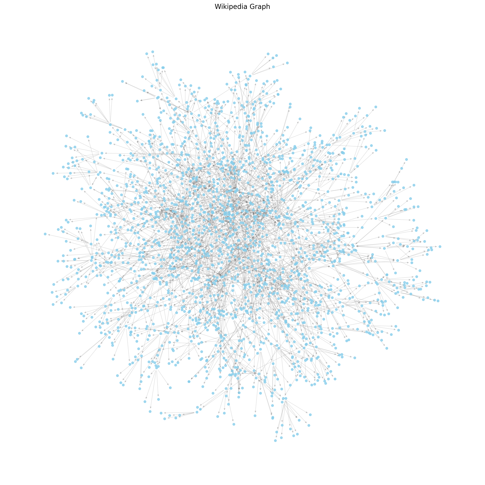
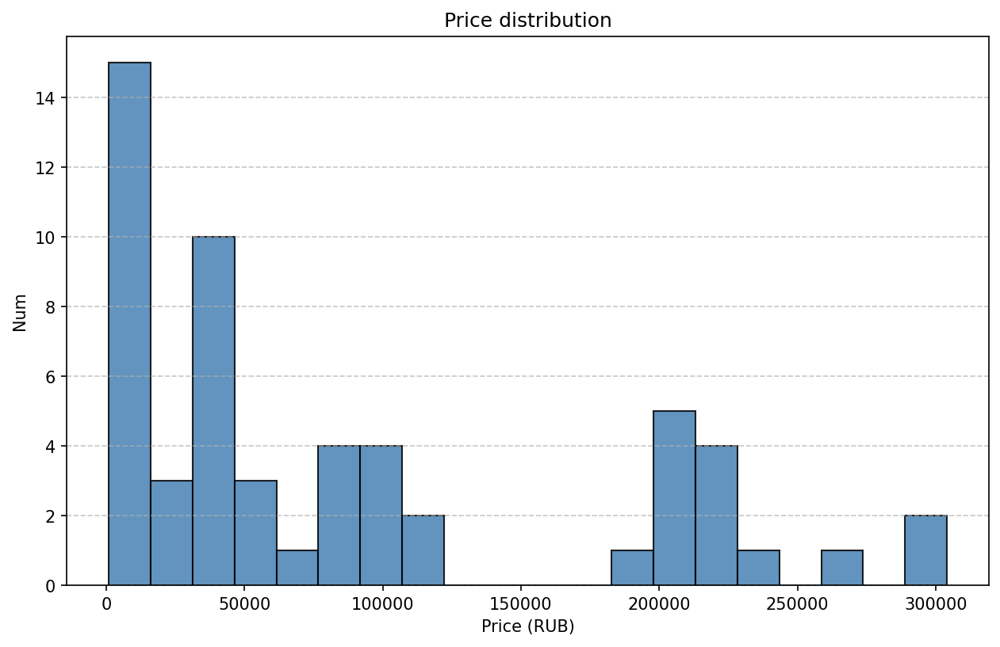

# ДЗ 2
Данная директория содержит выполненное ДЗ 2.

## Задание 1
### Описание:
Кроулер запускался командой ```python ./wikipedia_articles.py --url https://en.wikipedia.org/wiki/Spiking_neural_network --depth 5 --max-links 5```.

Отрисовщик запускался командой ```python ./draw_wiki.py --json Spiking_neural_network.json --output ./wiki_graph.png```.

В результате был получен граф:



## Задание 2
### Описание:
Кроулер запускался командой ```python ./selenium_amazon_crawl.py --query rtx4090```.

Отрисовщик запускался командой ```python ./draw_amazon.py --json ./rtx4090.json```.

В результате была получена гистограмма:

